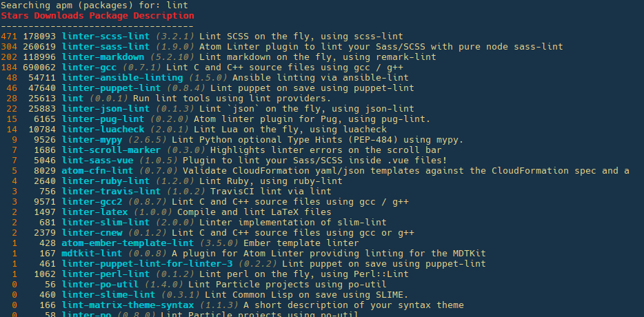

# Atom Advanced Search

> Search, sort, and filtering tool for Atom apm package manager




Version: 1.0.1

[https://github.com/charrismatic/atom-advanced-search](https://github.com/charrismatic/atom-advanced-search)

Topics: [atom](https://github.com/topics/atom),  [package](https://github.com/topics/package),  [cli](https://github.com/topics/cli),  

## About

A wrapper around Atoms apm command providing additional sorting and filters, with improved color and visual structure for the package search command.


### Install

```
npm install -g atom-advanced-search
```


### Usage

```sh
apm-search [options] <name>
```
### Options

__SELECT OPTIONS__

  `--select-packages`   Get packages (default)
  `--select-themes`   Get themes
  `--select-featured`   Get featured packages/themes (ignores name argument)

__SORT OPTIONS__

  `--sort-stars`  Sort by stars (default)
  `--sort-downloads`  Sort by downloads

__GENRAL OPTIONS__

  `--help`  Show this help menu
  `--verbose`  Show more information
  `--nocolor`  Disable color printing on output
  `--version`  Output package version number


### Author

Matt Harris <charrismatic@protonmail.com> (https://charrismatic.github.io/)

---

### Project Repo

-  type: "git"
-  url: "git+https://github.com/charrismatic/atom-advanced-search.git"

## Dependencies


## Development

Executable command is built with rollup. No other dependencies.

- `start`  node index.js",
- `dev`  ./node_modules/.bin/rollup -c ./module-config.js -w --environment INCLUDE_DEPS,NODE_ENV:development",
- `build`  ./node_modules/.bin/rollup -c ./module-config.js  --no-strict --extend --environment INCLUDE_DEPS,NODE_ENV:production"

### Issues

-  url: "https://github.com/charrismatic/atom-advanced-search/issues"

---

### Licesnse

MIT[MIT](https://opensource.org/licenses/undefined)


[https://www.npmjs.com/package/atom-advanced-search](https://www.npmjs.com/package/atom-advanced-search)
